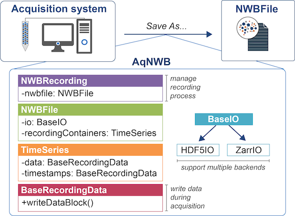

# AqNWB

**AqNWB is currently under active development and should not yet be used in practice.**

AqNWB is a C++ API for acquiring neurophysiological data directly into the NWB (Neurodata Without Borders) format.
Our goal is to provide a lightweight API to integrate with existing acquisition systems.

Please see the [AqNWB Documentation](https://neurodatawithoutborders.github.io/aqnwb/) for 
installation instructions and to learn more about AqNWB.

Below is a high-level overview of the project structure and capabilities we are targeting: 

## Requirements

- **Minimum Requirements:**
  - A C++17-compliant compiler
  - [CMake >= 3.15](https://cmake.org)
  - [HDF5 >= 1.10](https://github.com/HDFGroup/hdf5)
  - [Boost](https://www.boost.org/)
- **Documentation:** Additional requirements for building the documentation (optional)
  - [Doxygen](https://www.doxygen.nl/)
  - [Graphviz](https://graphviz.org/)
- **For Developers:** Additional requirements for developers (mode `dev`)
  - cppcheck
  - clang-format (optional, required for ``target=format-check``, ``target=format-fix``)
  - codespell  (optional, required for ``target=spell-check``, ``target=spell-fix``)

## Installation

See the [AqNWB Documentation](https://neurodatawithoutborders.github.io/aqnwb/) for installation and integration instructions. 
* [User Installation](https://neurodatawithoutborders.github.io/aqnwb/install_page.html)
* [Developer Installation](https://neurodatawithoutborders.github.io/aqnwb/dev_install_page.html)
